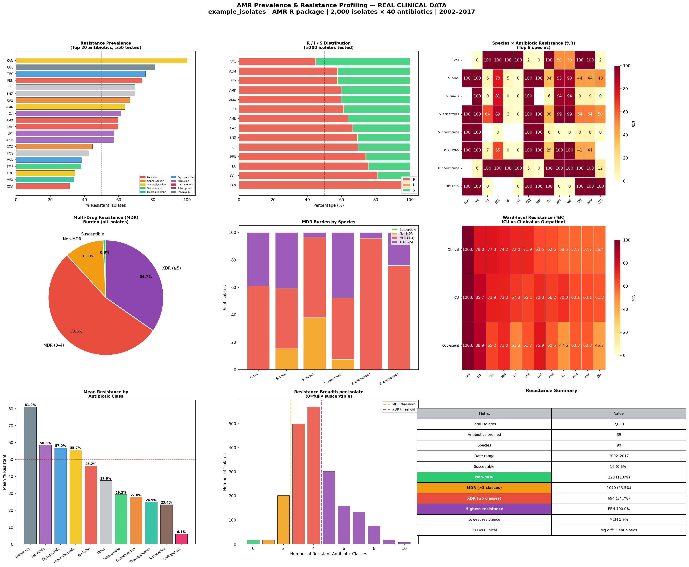

# Day 09 — AMR Prevalence & Resistance Profiling
### 🧬 30 Days of Bioinformatics | Subhadip Jana


> Comprehensive profiling of antimicrobial resistance (AMR) across 2,000 clinical isolates, 40 antibiotics, 90 species, and 15 years of surveillance data (2002–2017).

---

## 📊 Dashboard


---

## 🔬 Dataset — example_isolates (AMR R package)
| Feature | Value |
|---------|-------|
| Isolates | 2,000 clinical isolates |
| Antibiotics | 40 (R/S/I labels) |
| Species | 90 bacterial species |
| Wards | ICU, Clinical, Outpatient |
| Date range | 2002–2017 (15 years) |

---

## 📈 Key Results

### Resistance Prevalence (Top 5)
| Antibiotic | Class | %R |
|------------|-------|-----|
| KAN | Aminoglycoside | **100%** |
| COL | Polymyxin | 81.2% |
| TEC | Glycopeptide | 75.7% |
| PEN | Penicillin | 73.7% |
| RIF | Other | 69.6% |

### MDR Burden
| Category | Count | % |
|----------|-------|---|
| Susceptible | 16 | 0.8% |
| Non-MDR | 220 | 11.0% |
| **MDR (≥3 classes)** | **1,070** | **53.5%** |
| **XDR (≥5 classes)** | **694** | **34.7%** |

> ⚠️ **88.2% of isolates are MDR or XDR** — severe AMR burden in this clinical cohort

### Ward Differences (ICU vs Clinical, significant)
- **COL**: ICU 85.7% vs Clinical 78.0% (p=0.0004)
- **CAZ**: ICU 70.8% vs Clinical 63.5% (p=0.004)

---

## 🚀 How to Run
```bash
pip install pandas numpy matplotlib seaborn scipy
python amr_prevalence.py
```

---

## 📁 Structure
```
day09-amr-prevalence/
├── amr_prevalence.py
├── data/
│   └── isolates.csv
├── outputs/
│   ├── resistance_prevalence.csv
│   ├── species_resistance_matrix.csv
│   └── amr_prevalence_dashboard.png
└── README.md
```

---

## 🔗 Part of #30DaysOfBioinformatics
**Author:** Subhadip Jana | [GitHub](https://github.com/SubhadipJana1409) | [LinkedIn](https://linkedin.com/in/subhadip-jana1409)
